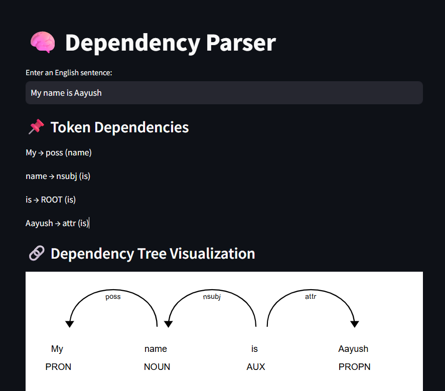

# 🧠 Day 23 – Visual Dependency Parsing using spaCy

Dependency parsing is one of those NLP concepts that seems complex at first—but once you see it in action, it completely changes how you look at sentence structure!

Today, as part of my #90DaysOfAI challenge, I explored how we can use **spaCy** to break down an English sentence and visualize the grammatical relationships between words like subject, object, modifiers, etc.

---

## What I built:
- Passed a simple English sentence using **spaCy**
- Extracted each token’s dependency role and head word (like `nsubj`, `ROOT`, `prep`)
- Visualized the **dependency tree** using **displacy**
- Wrapped it in a **Streamlit UI** for a clean and interactive experience

---

## Screenshot

<p align="center">
  
</p>

---

## Why This Matters

Dependency parsing is the foundation for tasks like:
- Question answering  
- Grammar correction  
- Machine translation  
- Text summarization

It helps us understand **who did what to whom** in a sentence — something even large language models rely on under the hood.

---

## How to Run This Project

### 1. Clone this repo:
```bash
git clone https://github.com/your-username/dependency-parser-app.git
cd dependency-parser-app
```

### 2. Install dependencies:
```
pip install -r requirements.txt
python -m spacy download en_core_web_sm
```

### 3. Run the Streamlit app:
```
streamlit run dependency_parser.py
```

---

## Learnings from Day 23
Just like how NER felt like magic on Day 2, dependency parsing felt like the moment when words stopped being a line—and started becoming a tree.

Still learning, still experimenting, and excited for what’s next!
